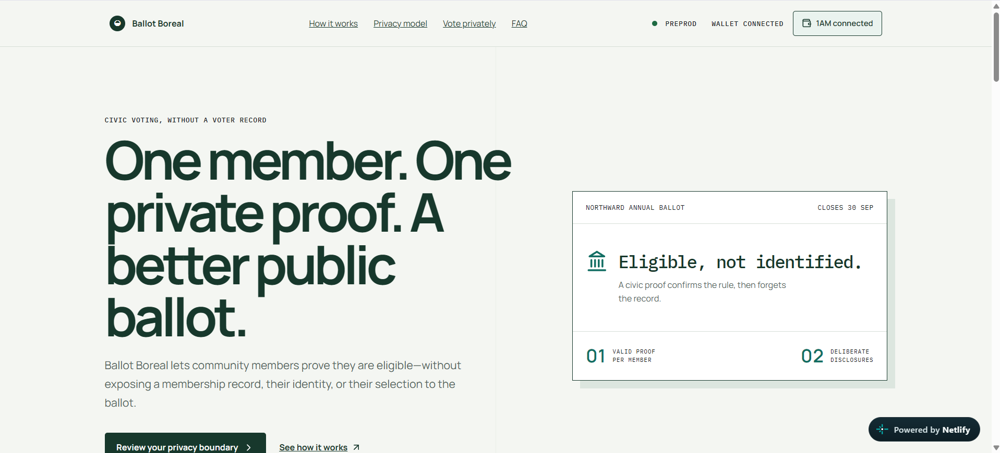
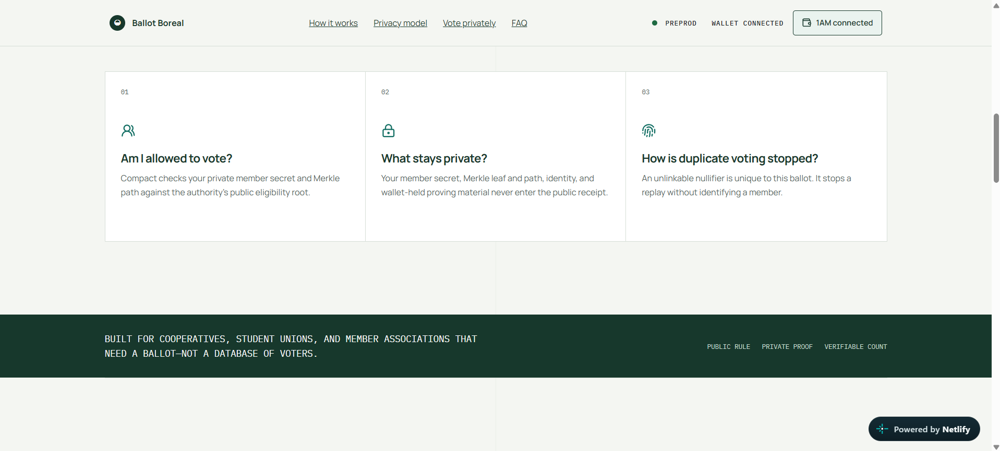
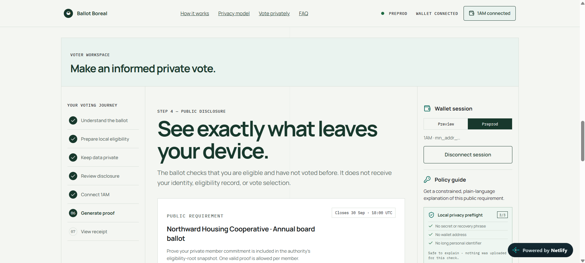
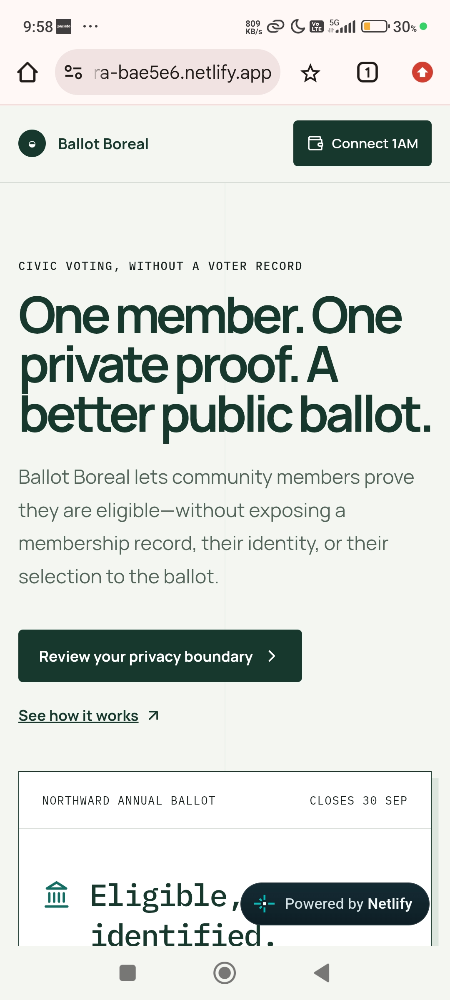
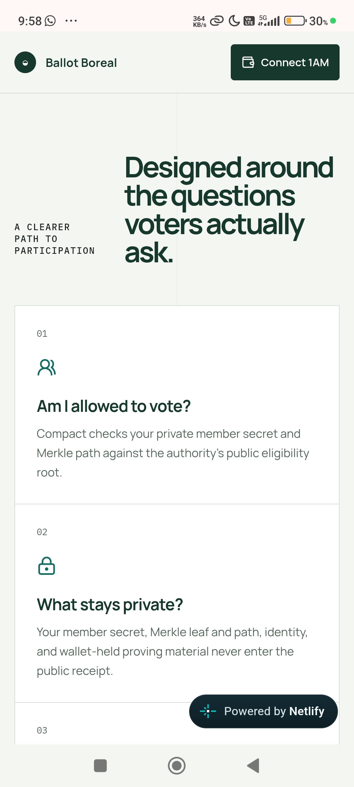
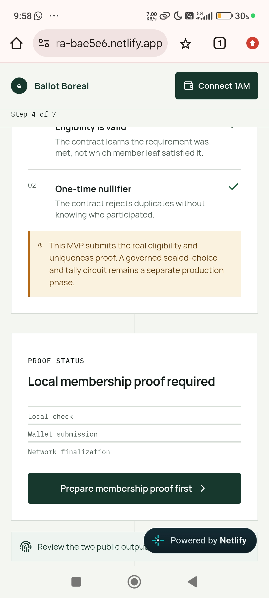

# Ballot Boreal

> A privacy-first civic ballot: prove eligibility once, without turning a voter into a public record.

[](https://github.com/kashishray324-cell/Ballot-Boreal/actions/workflows/ci.yml)

Ballot Boreal is a Midnight dApp prototype for housing cooperatives, campus bodies, and member associations. A voter proves membership in an authority-published eligibility Merkle root, obtains an anonymous ballot-scoped nullifier, and submits a real Compact circuit. The ledger receives the nullifier and public aggregate state—never the member leaf, Merkle path, identity, or local record.

The interface uses Nordic civic minimalism: quiet mineral surfaces, evergreen ink, paper-like rules, deliberate state labels, and a disclosure-first voter journey. It is designed for people who have never used a zero-knowledge proof before.

## Why Midnight

Traditional online voting forces a poor choice: put identity-linked eligibility on a server, or weaken duplicate-vote controls. Midnight’s selective-disclosure model lets the contract verify a private Merkle membership witness and expose only a replay-safe nullifier. That is a functional requirement, not visual crypto branding. See the [Midnight developer documentation](https://docs.midnight.network/) for the platform’s privacy and selective-disclosure model.

## Privacy model

| An observer can learn | An observer cannot learn |
| --- | --- |
| Ballot ID and authority-published membership root | Voter identity or wallet-held proving material |
| A valid eligibility proof was accepted | Member secret, leaf, and Merkle path |
| A one-time nullifier and total finalized proof count | The relationship between a nullifier and an individual |
| A finalized transaction ID and the permitted disclosure scope | Vote choice or raw eligibility record |

`disclose(true)` is justified because the verifier needs the policy outcome only. `disclose(nullifier)` is justified because the ledger needs to reject a replay. No member secret, leaf, or path is disclosed. See [docs/PRIVACY_MODEL.md](docs/PRIVACY_MODEL.md).

## Architecture

```text
React + local private state ── 1AM / Midnight DApp Connector ── Compact contract
        │                                  │                         │
        ├─ local witness only               └─ Preview / Preprod       └─ public aggregate + nullifiers
        │
        └─ FastAPI public API ── Neon Postgres
                    └─ Gemini (public policy text only; server-side key; structured output)
```

The API uses a pooled Neon URL for normal runtime traffic and a direct URL for migrations. Neon branches are isolated and have distinct connection strings, which supports a branch-first production/development workflow. [Neon’s workflow primer](https://neon.com/docs/get-started-with-neon/workflow-primer) and [connection guidance](https://neon.com/blog/inside-lubots-database-per-tenant-architecture) describe that separation.

Gemini is optional. When configured, the API uses the official `google-genai` SDK’s structured output and validates every result with Pydantic. It sends public policy wording only, with sensitive-pattern redaction and `store=False`; otherwise it takes a deterministic local fallback. The official SDK is the recommended production library, and structured output still requires application validation. [Gemini SDK documentation](https://ai.google.dev/gemini-api/docs/libraries) and [structured-output guide](https://ai.google.dev/gemini-api/docs/structured-output).

## Repository structure

```text
src/                 React app, 1AM adapter, Midnight.js providers, local private witness, UI tests
contracts/           Compact source, generated browser contract, prover/verifier keys, ZKIR
backend/app/         FastAPI API, async SQLAlchemy models, Gemini boundary service
backend/alembic/     Initial public-only database migration
netlify/functions/   Netlify-native TypeScript adapter for the public API routes
render.yaml          Render Blueprint for the production FastAPI service
docs/                Product, architecture, privacy, and demo documentation
.github/workflows/   CI and GitHub Pages deployment workflow
```

## Local setup

Requirements: Node 22, npm, Python 3.11+, [uv](https://docs.astral.sh/uv/), a 1AM wallet, the official Compact compiler matching the target Midnight release, and optionally Docker.

```sh
cp .env.example .env
npm ci
uv sync --directory backend --all-groups
npm run dev
uv run --directory backend uvicorn app.main:app --reload --port 8000
```

Open `http://localhost:5173`. The API is available at `http://localhost:8000/docs` in development.

### Wallet and networks

The frontend discovers UUID-keyed providers from `window.midnight`, sorts 1AM first, and connects with the selected Preview or Preprod network. Switching networks clears the session-level wallet connection. The proof flow uses the official DApp Connector v4 proving, balancing, and submission APIs, then waits for Midnight.js finalization before showing or mirroring a receipt. If no shared contract address is configured, it deploys a clearly identified personal demo ballot using the local witness root and stores that address in the browser.

### Preprod

- Contract address: [`8992bc5aa1baba16663e189d34fab01b6dc0479a13edf239a83612710038c745`](https://explorer.1am.xyz/contract/8992bc5aa1baba16663e189d34fab01b6dc0479a13edf239a83612710038c745?network=preprod)
- Deployment transaction: [`97517ea09da6ef93863476017559870606c6a7d45dc79ea77dfd6874de6b81d4`](https://explorer.1am.xyz/tx/97517ea09da6ef93863476017559870606c6a7d45dc79ea77dfd6874de6b81d4?network=preprod)

### Compact and proof server

Compile with the official compiler version compatible with your target:

```sh
compact compile contracts/BallotBoreal.compact contracts/artifacts
npm run contract:validate
npm run contract:artifacts
```

The committed browser artifacts were generated with Compact 0.31.1 (language 0.23). Vite publishes the circuit keys and binary ZKIR at `/keys` and `/zkir`; 1AM supplies the proving provider selected by the wallet user. Set `VITE_BALLOT_CONTRACT_ADDRESS_PREVIEW` and/or `VITE_BALLOT_CONTRACT_ADDRESS_PREPROD` to authority-deployed shared ballot addresses. `contracts/README.md` records the contract boundary and disclosures.

### Neon and Gemini

Create `production` and `development` Neon branches. Set `DATABASE_URL` to the pooled connection string for API traffic and `DATABASE_URL_UNPOOLED` to the direct connection string for Alembic operations. `DATABASE_DIRECT_URL` remains supported as a legacy alias. The database schema stores only public metadata, receipts, scope, aggregate counts, and hashes of public policy requests.

Set `GEMINI_API_KEY` only in backend deployment secrets. Gemini never receives a private witness, seed phrase, identity document, exact attribute, vote selection, or wallet address. Without it, the deterministic local fallback stays available.

## Verification

```sh
npm run contract:validate
npm test
npm run lint
npm run build
uv run --directory backend ruff check .
uv run --directory backend pytest
```

The repository contains frontend, Netlify adapter, and backend tests covering Compact boundary assertions, redaction and local policy preflight, receipt validation, private witness persistence and rotation, provider discovery, network selection, wallet recovery, persistent wallet access, API routing and fallback behavior, FastAPI health/database behavior, Gemini fallback, public-policy hash caching, receipt privacy checks, and aggregation.

## Production deployment: Netlify + Render

The recommended split is a Netlify-hosted Vite frontend and the FastAPI service on Render. `render.yaml` defines the backend as a Singapore-region Python web service, runs Alembic before Uvicorn starts, binds to Render's `$PORT`, and uses a dependency-free liveness probe. The frontend retries one transient request so a free Render service can wake without immediately presenting a failure.

1. In Render, choose **New → Blueprint**, connect `kashishray324-cell/Ballot-Boreal`, and use the repository-root `render.yaml`.
2. Set `DATABASE_URL` to the pooled Neon URL, `DATABASE_URL_UNPOOLED` to its direct URL, and `ALLOWED_ORIGINS` to the exact Netlify origin (for example, `https://ballot-boreal.netlify.app`). `DATABASE_DIRECT_URL` remains supported as a legacy alias. `GEMINI_API_KEY` is optional. These are backend secrets and must never use a `VITE_` prefix.
3. After Render is healthy, open `https://YOUR-RENDER-SERVICE.onrender.com/health`. It should report `"database": true`.
4. In Netlify, set only `VITE_API_URL=https://YOUR-RENDER-SERVICE.onrender.com`, then trigger a fresh frontend deploy. Do not append `/api`; FastAPI serves `/metrics`, `/policy-plan`, and `/receipts` from the service root.

Import the GitHub repository into Netlify or use `npm run deploy:netlify`; dragging only `dist/` is not a complete project deployment. The Netlify function remains as a same-origin fallback for local or alternate hosting, but production traffic should use the Render URL once `VITE_API_URL` is set.

Render's free web service sleeps after inactivity, has an ephemeral filesystem, and is intended for evaluation rather than strict production uptime. Neon keeps the database persistent, and upgrading only the Render compute plan removes the cold-start tradeoff without changing this architecture.

## CI/CD

Every push and pull request runs Node 22 install, Python/uv setup, official Compact devtools plus the pinned 0.31.1 toolchain, artifact-diff checking, contract validation, frontend lint/tests/build, and backend lint/tests. Netlify redeploys the frontend and Render redeploys the backend from the connected Git repository.

## Live Website URL

[https://aquamarine-chimera-bae5e6.netlify.app/](https://aquamarine-chimera-bae5e6.netlify.app/)

**Repository:** [kashishray324-cell/Ballot-Boreal](https://github.com/kashishray324-cell/Ballot-Boreal).

## Demo Video URL

[Open the Ballot Boreal demo video](https://drive.google.com/file/d/1J-1JSnDlDyf7dVvET1_uITuk7zvaCDX8/view?usp=sharing)

## Website Screenshots

### Homepage



### Privacy explainer



### Voter workspace



## Mobile Responsive UI

### Mobile homepage



### Mobile privacy explainer



### Mobile voter workspace



## Limitations and next steps

- A real 1AM provider, wallet approval, network DUST, and reachable Midnight indexer/proving services are required to send a transaction.
- Without a configured shared contract address, the app deploys a single-member personal demo ballot; production must distribute authority-issued Merkle paths and configure the shared address.
- Production still needs an independent contract audit, governed root rotation/election windows, accessibility testing with voters, and a result-opening/tally circuit appropriate to the ballot rules.

See [docs/DEMO_SCRIPT.md](docs/DEMO_SCRIPT.md) for a one-minute walkthrough and [docs/ARCHITECTURE.md](docs/ARCHITECTURE.md) for system decisions.
